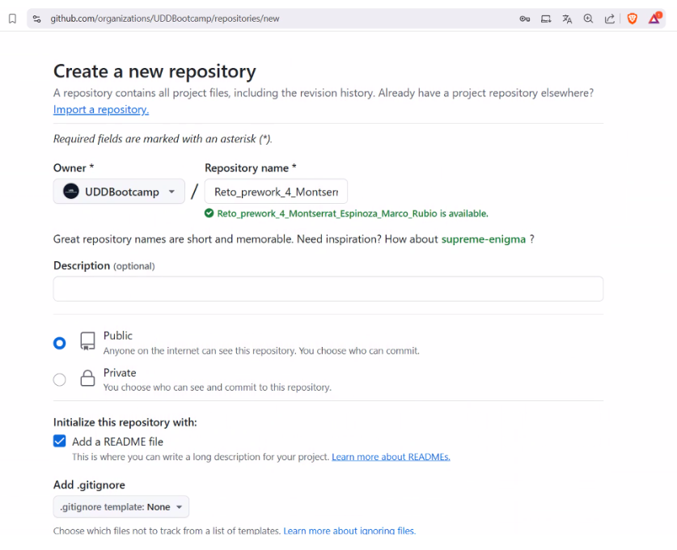

# Reto_prework_4_Montserrat_Espinoza_Marco_Rubio

INTEGRANTES:

- Montserrat Espinoza
- Marco Rubio

---

## Primera parte: se crea repositorio y se sube primer proyecto

1 - Se crea un repositorio en **GitHub** llamado **Reto_prework_4_Montserrat_Espinoza_Marco_Rubio**, con visibilidad pública.

 

2 - Se abre una terminal y se navega hasta la carpeta donde se clonará el repositorio, utilizando el comando **git clone** seguido de la URL del repositorio se clonara el archivo en la computadora.

 

3 - Se abre PSeInt y se escribe ejemplo de pseudocodigo en el archivo.

 

4 - Se abre la carpeta donde se clono el proyecto, se utiliza **git add .** para agregar el archivo al staging area.
Se utiliza **git commit** para crear un nuevo commit con el archivo agregado.

 

5 - Se utiliza el comando **git push** para subir los cambios al repositorio en GitHub.

 

6 - Se verifica archivo subido para ver la información agregada.

  

## Segunda parte: se clona proyecto

7 - Se clona el repositorio en la computadora del compañero con **git clone** seguido de la URL del repositorio.

 

8 - Se hacen cambios en el archivo creado por la compañera.

 

9 - Se utiliza el comando **git add** seguido del nombre del archivo para añadirlo al staging area. Luego, se usa **git commit** para registrar los cambios en el repositorio

 

10 - Se utiliza el comando **git push** para subir los cambios al repositorio en GitHub.

 

11 - Se verifica los cambios en el repositorio en GitHub.

  

## Tercera parte: actualizar repositorios locales

12 - Se utiliza **git pull** para descargar los cambios que los demás hayan subido al repositorio en GitHub.

